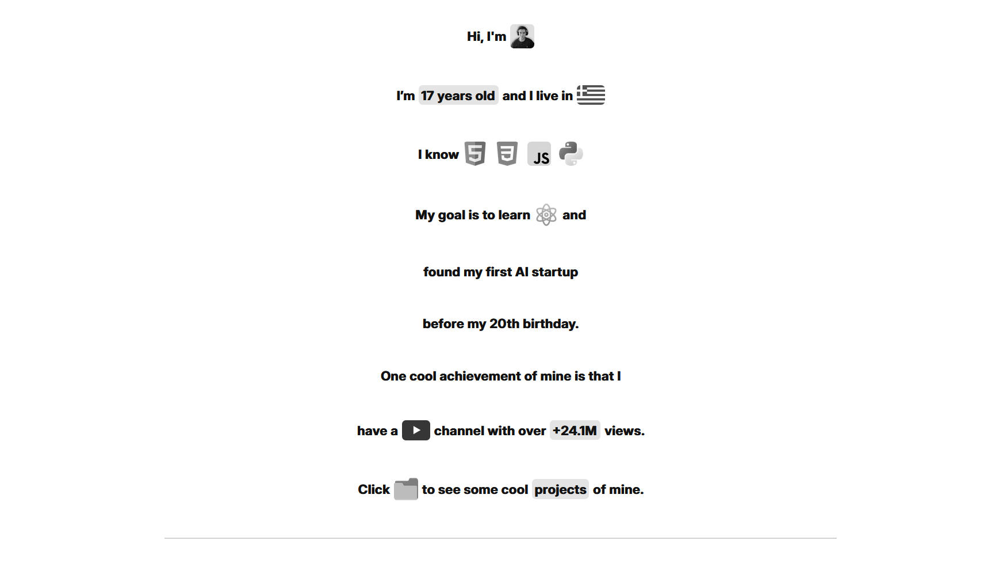

# 📂 A Really Basic Portfolio

This is the **Projects** section of my personal portfolio. It features all the websites and web projects I’ve worked on, presented in a sleek, responsive gallery with live preview modals.

## 👇 Click The Link Below To Check It

🌐 **[Website](https://forjoee.github.io/Portofolio/)**

## 🧑‍💻 Technologies Used

- **HTML** – Structure
- **CSS** – Styling & responsive layout
- **JavaScript** – Modal logic, interactivity

## 📸 Preview

## 🚧 Known Limitations

- Some project previews are hosted on **Wix**, and their branding may appear. Due to platform restrictions, it is not allowed to hide the Wix banner via code injection.

## 🙏 Credits

- Fonts by [Inter](https://rsms.me/inter/)
- Icons from [Font Awesome](https://fontawesome.com/)